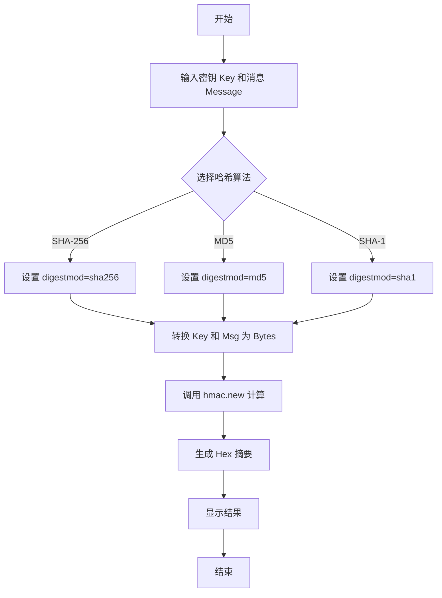
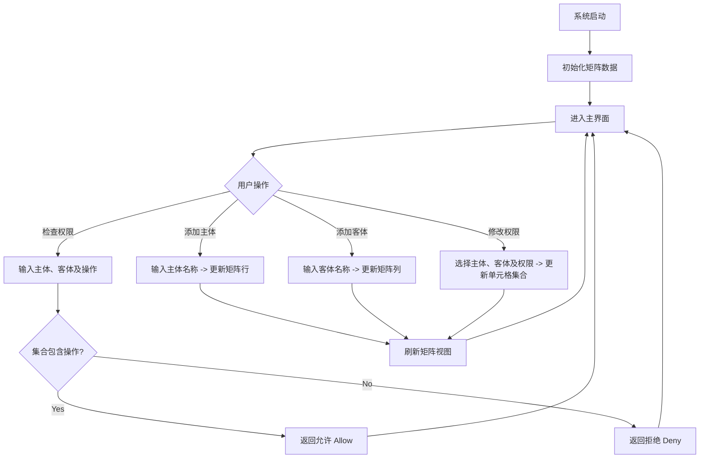

# 实验报告：HMAC算法与访问控制矩阵

## 一、实验目的和要求

1.  **理解 HMAC 算法与实施**：深入理解消息鉴别码（HMAC）的工作原理，掌握其在数据完整性验证和身份认证中的应用。
2.  **理解访问控制技术的基本原理**：学习访问控制的基本概念，理解主体、客体和权限之间的关系。
3.  **掌握访问控制矩阵的实现原理与步骤**：设计并实现一个基于访问控制矩阵（Access Control Matrix, ACM）的系统，模拟权限的管理和判定过程。

## 二、实验内容

1.  **HMAC 算法应用**：结合 HMAC 算法代码，开发一个图形化工具，能够输入密钥和消息，选择不同的哈希算法（如 MD5, SHA-1, SHA-256），计算并显示 HMAC 值。
2.  **访问控制矩阵实现**：设计并编写程序实现访问控制矩阵。程序需具备图形化操作界面，支持动态添加主体、客体，修改主体对客体的权限（如读、写、执行、拥有），并能直观地显示矩阵状态及验证权限。

## 三、实验步骤

### 1. HMAC 算法实现

#### 1.1 算法详细实现过程

HMAC (Hash-based Message Authentication Code) 是一种使用单向散列函数结合密钥的消息鉴别码。

**核心公式**：
$$HMAC(K, M) = H((K' \oplus opad) || H((K' \oplus ipad) || M))$$

其中：
- $H$ 为哈希函数（如 SHA-256）。
- $K$ 为密钥。
- $M$ 为消息输入。
- $ipad$ 为内部填充（0x36），$opad$ 为外部填充（0x5c）。

**代码实现逻辑**：
本实验使用 Python 的标准库 `hmac` 和 `hashlib` 实现。核心计算部分代码如下：

```python
def calculate_hmac(self):
    key = self.key_entry.get()
    msg = self.msg_text.get("1.0", tk.END).strip()
    algo_name = self.algo_var.get()

    # ... 输入校验 ...

    try:
        # Convert string to bytes
        key_bytes = key.encode('utf-8')
        msg_bytes = msg.encode('utf-8')
        
        # Get digestmod
        digestmod = getattr(hashlib, algo_name)
        
        # Calculate HMAC
        h = hmac.new(key_bytes, msg_bytes, digestmod)
        hmac_hex = h.hexdigest()
        
        self.result_var.set(hmac_hex)
    except Exception as e:
        messagebox.showerror("错误", f"计算失败: {str(e)}")
```

1.  获取用户输入的密钥 $K$ 和消息 $M$。
2.  将字符串类型的密钥和消息转换为字节流（bytes）。
3.  根据用户选择（MD5/SHA1/SHA256），指定哈希函数。
4.  调用 `hmac.new(key, msg, digestmod)` 创建 HMAC 对象。
5.  调用 `.hexdigest()` 获取十六进制格式的鉴别码。

#### 1.2 算法实现流程图 (Mermaid)



#### 1.3 实例验证与截图

**实验代码文件**：`task2/hmac_gui.py`

**操作步骤**：
1.  运行程序。
2.  输入密钥：`secret_key`
3.  输入消息：`Hello World`
4.  选择算法：`sha256`
5.  点击“计算 HMAC”。

**预期结果**：
HMAC (SHA256) 结果应为特定哈希值。

*(此处请插入运行 `hmac_gui.py` 后的界面截图，包含输入和计算结果)*

---

### 2. 访问控制矩阵 (ACM) 实现

#### 2.1 算法详细实现过程

访问控制矩阵是一个二维矩阵，行表示主体（Subject），列表示客体（Object），矩阵中的元素 $M[s, o]$ 表示主体 $s$ 对客体 $o$ 拥有的权限集合。

**数据结构设计**：
使用嵌套字典（Hash Map）来存储稀疏矩阵，优化空间复杂度。
`matrix = { subject_name: { object_name: {permission_set} } }`

**功能实现**：

1.  **数据结构初始化**：
    ```python
    # Data Structure: matrix[subject][object] = {set of permissions}
    self.subjects = []
    self.objects = []
    self.matrix = {} # Dict of Dict of Sets
    ```

2.  **添加主体与客体**：
    ```python
    def add_subject_logic(self, name):
        if name and name not in self.subjects:
            self.subjects.append(name)
            self.matrix[name] = {}
            for obj in self.objects:
                self.matrix[name][obj] = set()
    ```

3.  **修改权限**：
    ```python
    def set_permission(self, sub, obj, rights):
        if sub in self.subjects and obj in self.objects:
            self.matrix[sub][obj] = rights
    ```

4.  **权限检查**：
    ```python
    def check(self):
        s = sub_var.get()
        o = obj_var.get()
        op = op_var.get()
        if s in self.matrix and o in self.matrix[s]:
            if op in self.matrix[s][o]:
                return "允许访问 (Allow)"
            else:
                return "拒绝访问 (Deny)"
    ```

5.  **可视化**：使用 `Treeview` 组件将数据结构渲染为表格形式。

#### 2.2 算法实现流程图



#### 2.3 实例验证与截图

**实验代码文件**：`task2/acm_gui.py`

**验证场景**：
1.  **初始状态**：系统内置 Alice, Bob, Admin 以及 File1.txt, App.exe。
2.  **权限检查 1**：
    - 主体：Alice
    - 客体：File1.txt
    - 操作：Write
    - **结果**：允许（Alice 拥有 Read, Write 权限）。
3.  **权限检查 2**：
    - 主体：Bob
    - 客体：File1.txt
    - 操作：Write
    - **结果**：拒绝（Bob 只有 Read 权限）。
4.  **修改权限**：
    - 将 Bob 对 File1.txt 的权限增加 Write。
    - 再次检查 Bob 写权限，结果应为允许。

*(此处请插入运行 `acm_gui.py` 后的主界面截图，以及权限检查对话框的截图)*

## 四、实验总结

通过本次实验，我对信息安全领域中的消息鉴别与访问控制技术有了更加深入的理解和实践体会。

在 HMAC 算法的学习过程中，我认识到它并非简单地将密钥与消息拼接后进行哈希运算，而是通过内外两层填充（ipad 和 opad）与密钥进行异或操作，再分别进行哈希计算。这种设计有效地抵御了长度扩展攻击等安全威胁，保证了消息的完整性和来源的真实性。通过编写图形化工具并使用不同的哈希算法（MD5、SHA-1、SHA-256）进行实际计算，我验证了 HMAC 的正确性，也加深了对其工作机制的理解。

在访问控制矩阵的实现过程中，我深刻体会到访问控制策略在底层是如何通过数据结构来存储和判定的。矩阵模型以主体为行、客体为列，每个单元格存储对应的权限集合，概念清晰、易于理解。然而，在大规模系统中，如果主体和客体数量庞大，直接存储完整矩阵会导致空间爆炸问题。本实验采用嵌套字典（稀疏矩阵）的方式进行存储，有效地优化了空间复杂度，这也让我对实际系统中访问控制的实现有了更务实的认识。

此外，本次实验中构建的图形化用户界面大大提升了系统的交互性和可操作性。用户可以直观地查看矩阵状态、动态添加主体和客体、修改权限并验证访问请求，使得原本抽象的算法逻辑变得可视化、易于演示，达到了实验预期的教学目的。

