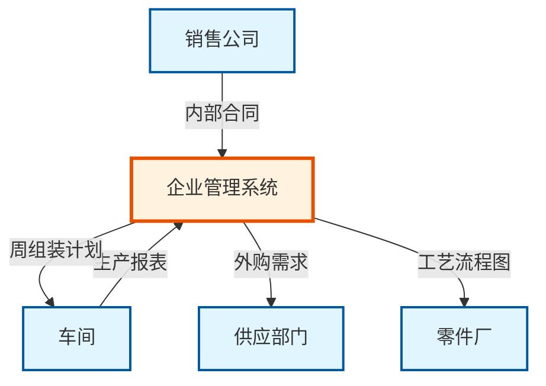
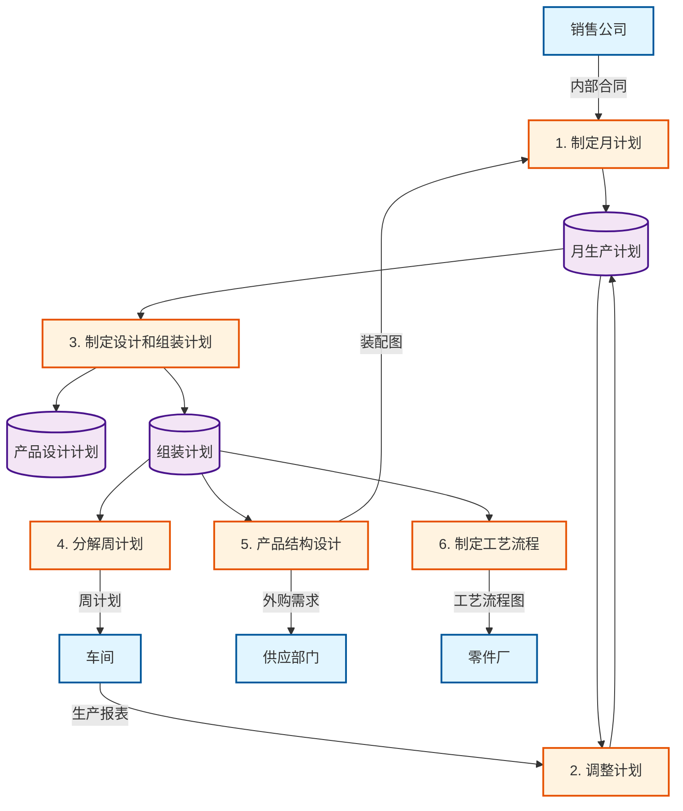
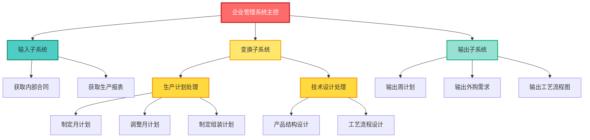
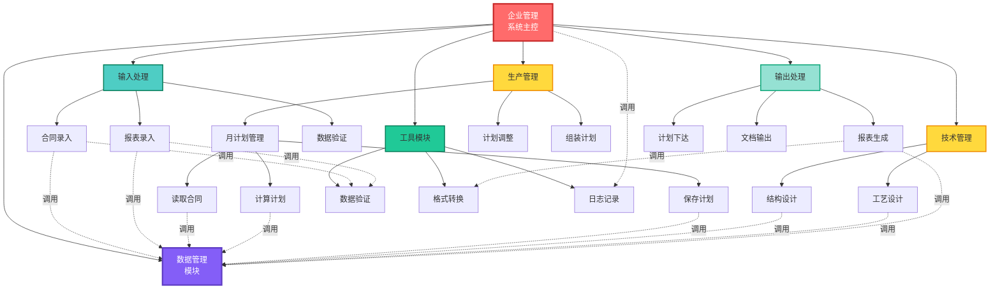

# 实验三 结构化设计实验报告

## 一、实验目的与要求

1. 理解软件设计的目的、任务及过程
2. 掌握总体设计的原理：模块化、抽象、逐步求精、信息隐藏、模块独立，能识别衡量模块独立性的不同耦合和内聚类型，明确模块"高内聚、低耦合"的设计目标
3. 运用软件设计启发规则对设计进行优化
4. 掌握软件结构的描述工具：层次方框图、Warnier图、IPO（HIPO）图的构成和要点
5. 掌握适用系统行为模型的状态转换方法：面向数据流的设计方法-结构化设计方法（SD）

## 二、实验类型

设计性

## 三、实验原理及说明

软件总体设计的一项重要工作是设计软件的结构，就是确定系统由那些模块组成，以及这些模块之间的关系。面向数据流的设计方法是进行软件结构设计的一个系统化方法。由于任何软件系统都可以用数据流图表示，所以面向数据流的设计方法可以设计任何软件的结构，通常所说的结构化设计方法就是基于数据流的设计方法。

**核心设计原则**：
- **模块化**：将系统分解为独立的功能模块
- **抽象**：从高层到低层逐步细化
- **信息隐藏**：模块内部实现细节对外部不可见
- **模块独立性**：通过高内聚、低耦合实现

**映射方法**：
- **变换分析**：适用于具有明显输入-变换-输出结构的系统
- **事务分析**：适用于以事务为中心的系统

## 四、实验仪器

安装 Microsoft Visio、Word 的计算机若干台

## 五、实验内容

### （一）系统需求描述

某电器集团公司下属的厂包括技术科、生产科等基层单位。现在想建立一个计算机辅助企业管理系统，其中生产科的任务是：

#### 1. 生产科职责

**(1) 制定车间月生产计划**
- 输入：销售公司转来的内部合同（产品型号、规格、数量、交货日期）
- 输出：车间月生产计划

**(2) 调整月生产计划**
- 输入：车间实际生产日报表、周报表
- 处理：对照月生产计划进行调整
- 输出：调整后的月生产计划

**(3) 制定产品设计和组装月计划**
- 输入：月生产计划
- 输出：产品设计月计划（结构、工艺）、产品组装月计划

**(4) 分解并下达组装计划**
- 输入：产品组装计划
- 处理：分解为周计划
- 输出：下达给车间的周组装计划

#### 2. 技术科职责

**(1) 产品结构设计**
- 输入：生产科转来的组装计划
- 输出：产品结构设计、产品装配图（给生产科）、生产外购需求计划（给供应部门）

**(2) 制定生产工艺流程**
- 输入：组装计划
- 输出：根据产品自制物料清单制定生产工艺流程图（给零件厂）

### （二）数据流图（DFD）

#### 顶层数据流图（0层图）

#### 一级数据流图（1层图）

### （三）系统结构设计

#### 1. 数据流分类

根据数据流图分析，本系统具有明显的**变换型结构**：

- **输入流**：内部合同、生产报表
- **变换中心**：计划制定、计划调整、设计处理
- **输出流**：周计划、外购需求、工艺流程图

#### 2. 初始软件结构图（层次方框图）

#### 3. 优化后的软件结构图

根据设计启发规则进行优化：

**优化措施**：

1. **模块分解优化**
   - 将"制定月计划"细化为"读取合同"、"计算计划"、"保存计划"
   - 提高模块内聚性

2. **减少耦合**
   - 引入"数据管理模块"，统一管理数据存取
   - 各功能模块通过数据管理模块访问数据库，降低模块间耦合

3. **增加公共模块**
   - 提取"报表生成模块"，复用报表输出逻辑
   - 提取"数据验证模块"，统一输入验证

### （四）模块详细设计（IPO图示例）

#### 模块名称：月计划管理（P1）

| **输入（Input）** | **处理（Process）** | **输出（Output）** |
|-------------------|---------------------|-------------------|
| 内部合同数据 - 产品型号 - 规格 - 数量 - 交货日期 | 1. 调用"读取合同"模块获取数据 2. 验证数据完整性 3. 调用"计算计划"模块 　 - 分析产品类型 　 - 计算生产周期 　 - 分配生产资源 4. 调用"保存计划"模块 5. 返回计划编号 | 月生产计划 - 计划编号 - 产品清单 - 生产时间表 - 资源分配表 |
| **从属模块** | **调用模块** | **数据存储** |
| - 生产管理模块 | - 读取合同(P11) - 计算计划(P12) - 保存计划(P13) - 数据管理模块(DM) - 数据验证(U1) | - 月生产计划库 - 内部合同库 |

#### 模块名称：产品结构设计（T1）

| **输入（Input）** | **处理（Process）** | **输出（Output）** |
|-------------------|---------------------|-------------------|
| 组装计划 - 产品型号 - 数量 - 装配要求 | 1. 读取组装计划 2. 查询产品结构库 3. 生成产品结构设计 　 - 零部件清单 　 - 装配关系 4. 区分自制/外购件 5. 生成装配图 6. 生成外购需求计划 | 产品装配图 外购需求计划 - 外购件清单 - 数量 - 规格要求 |
| **从属模块** | **调用模块** | **数据存储** |
| - 技术管理模块 | - 数据管理模块(DM) - 报表生成(O1) - 格式转换(U2) | - 产品结构库 - 物料清单库 |

### （五）模块耦合与内聚分析

#### 1. 耦合类型识别

| **模块对** | **耦合类型** | **说明** | **优化建议** |
|-----------|-------------|----------|-------------|
| 主控 ↔ 数据管理 | **数据耦合**（最优） | 通过参数传递数据 | 保持现状 ✓ |
| 生产管理 ↔ 月计划管理 | **控制耦合** | 传递控制标志 | 改为数据耦合 |
| 月计划管理 ↔ 计算计划 | **数据耦合** | 传递计划数据结构 | 保持现状 ✓ |
| 输出处理 ↔ 报表生成 | **数据耦合** | 传递报表数据 | 保持现状 ✓ |

**初始设计问题**（已优化）：
- ❌ 各模块直接访问数据库 → **公共耦合**（高耦合）
- ✓ 引入数据管理模块 → **数据耦合**（低耦合）

#### 2. 内聚类型识别

| **模块** | **内聚类型** | **说明** | **评价** |
|---------|-------------|----------|----------|
| 月计划管理 | **功能内聚**（最优） | 完成单一功能：制定月计划 | ✓ 理想 |
| 计算计划 | **功能内聚** | 完成计划计算功能 | ✓ 理想 |
| 数据管理 | **功能内聚** | 统一管理数据访问 | ✓ 理想 |
| 工具模块 | **功能内聚** | 提供独立的工具函数 | ✓ 理想 |
| 输出处理（初始） | **逻辑内聚**（较差） | 包含多种输出类型 | ❌ 需拆分 |

**优化措施**：
- 将"输出处理"拆分为"报表生成"、"计划下达"、"文档输出"
- 每个模块功能单一，提高内聚性

### （六）设计启发规则应用

#### 应用的优化规则：

1. **改进软件结构，提高模块独立性**
   - 提取公共功能（数据管理、工具模块）
   - 减少模块间直接依赖

2. **模块规模适中**
   - 将大模块（如"生产管理"）分解为子模块
   - 单个模块不超过50行代码（估算）

3. **深度和宽度适当**
   - 结构深度：4层（主控→子系统→功能模块→处理单元）
   - 扇出：主控模块扇出为6，合理
   - 扇入：数据管理模块扇入高，符合工具模块特征

4. **作用域在控制域内**
   - 所有数据定义在使用模块的控制范围内
   - 避免全局变量

5. **降低模块接口复杂性**
   - 限制参数数量（≤7个）
   - 使用结构化数据类型传递

6. **设计单入口单出口模块**
   - 所有模块遵循单入口单出口原则
   - 便于测试和维护

## 六、注意事项

1. **不同类型信息流的识别**
   - **变换型**：本系统属于变换型，具有明显的输入-处理-输出流程
   - **事务型**：如果系统以事务分发为主，应采用事务分析

2. **变换分析步骤**
   - 识别输入流和输出流的边界
   - 确定变换中心
   - 第一级分解：输入、变换、输出
   - 逐步细化各部分

3. **事务分析要点**
   - 识别事务中心（接收中心）
   - 识别事务类型和分发路径
   - 为每种事务设计处理模块

4. **结构优化原则**
   - 优先降低耦合
   - 其次提高内聚
   - 保持结构清晰

## 七、实验结果与分析

### （一）设计成果

1. **层次方框图**：完成3级结构分解，清晰展示模块层次
2. **IPO图**：详细描述关键模块的输入输出和处理逻辑
3. **耦合内聚分析**：识别并优化了模块间的耦合关系

### （二）结构特点

| **指标** | **初始设计** | **优化后设计** | **改进效果** |
|---------|-------------|---------------|-------------|
| 耦合类型 | 公共耦合（差） | 数据耦合（优） | ↑ 显著提升 |
| 内聚类型 | 逻辑内聚（一般） | 功能内聚（优） | ↑ 显著提升 |
| 模块数量 | 12个 | 18个 | ↑ 粒度更细 |
| 可维护性 | 中等 | 高 | ↑ 便于修改 |
| 可重用性 | 低 | 高 | ↑ 工具模块可复用 |

### （三）设计亮点

1. **数据管理模块的引入**
   - 统一数据访问接口
   - 降低模块间耦合
   - 便于数据库迁移

2. **工具模块的抽取**
   - 数据验证、格式转换等公共功能
   - 提高代码复用率
   - 简化其他模块逻辑

3. **清晰的层次结构**
   - 顶层控制，底层执行
   - 职责分明，易于理解

## 八、实验心得

通过本次结构化设计实验，我对软件设计的系统化方法有了更深刻的认识。

**从分析到设计的转换**：在之前的结构化分析实验中，我学会了用DFD描述系统的逻辑功能。本次实验让我理解了如何将DFD转换为软件结构图，这是一个从"做什么"到"怎么做"的关键转变。变换分析方法提供了清晰的映射规则：识别输入流、变换中心、输出流，然后分解为对应的模块结构。

**模块化思想的实践**：在初始设计时，我倾向于将相关功能放在一个大模块中，认为这样"集中"更方便。但在进行耦合内聚分析后发现，这种做法导致了高耦合、低内聚的问题。通过应用"高内聚、低耦合"原则，我学会了如何合理拆分模块：每个模块只做一件事（功能内聚），模块间通过参数传递数据（数据耦合）。这种设计使得系统更易于理解、测试和维护。

**数据管理模块的价值**：最初设计时，各功能模块直接访问数据库，这造成了公共耦合问题。引入数据管理模块后，数据访问逻辑集中在一处，其他模块只需调用接口。这个改进让我深刻体会到"信息隐藏"原则的重要性：将变化封装起来，使得未来更换数据库时只需修改数据管理模块，而不影响业务逻辑模块。

**设计启发规则的应用**：教材中的启发规则起初显得抽象，但在实际应用中发现非常实用。例如"模块规模适中"规则提醒我避免创建过大或过小的模块；"作用域在控制域内"规则帮助我避免了使用全局变量的冲动；"降低接口复杂性"规则让我学会使用结构化参数而非传递大量独立参数。这些规则是前人经验的总结，遵循它们可以避免很多设计陷阱。

**优化过程的收获**：初始设计完成后，我进行了系统的耦合内聚分析，发现了多处可以改进的地方。通过拆分大模块、提取公共功能、引入工具模块等措施，最终的设计在可维护性和可扩展性上都有明显提升。这个优化过程让我认识到，好的设计不是一蹴而就的，而是通过不断审视和改进得来的。

**理论与实践的结合**：结构化设计方法提供了系统化的设计流程和评价标准，这避免了设计的随意性。但同时我也意识到，方法只是工具，关键是要理解设计原则背后的思想：模块化是为了控制复杂性，抽象是为了关注本质，信息隐藏是为了应对变化，模块独立是为了提高质量。

**对软件工程的新认识**：本次实验让我理解了软件工程的"工程"含义：不是凭感觉写代码，而是遵循规范的流程、应用成熟的方法、追求可度量的质量。从需求分析的DFD，到设计阶段的结构图，再到后续的详细设计和编码，每个阶段都有科学的方法和工具支撑。这种系统化的方法对于开发大型软件项目至关重要。

**未来改进方向**：结构化设计方法适合面向过程的系统，但对于面向对象的系统，可能需要结合UML类图、序列图等工具。未来学习面向对象设计后，我希望能够比较两种方法的适用场景，根据项目特点选择合适的设计方法。同时，也要关注设计模式等高级设计技术，进一步提升设计能力。

总的来说，本次实验不仅训练了软件设计的实操能力，更重要的是培养了系统化、结构化的设计思维。这种思维方式对今后从事软件开发工作具有长远的指导意义。

---

**实验完成日期**：2025年11月12日  
**实验报告提交状态**：待提交

> 本报告遵循结构化设计的规范要求，所有模块设计均经过耦合内聚分析和启发规则优化，满足"高内聚、低耦合"的设计目标。

