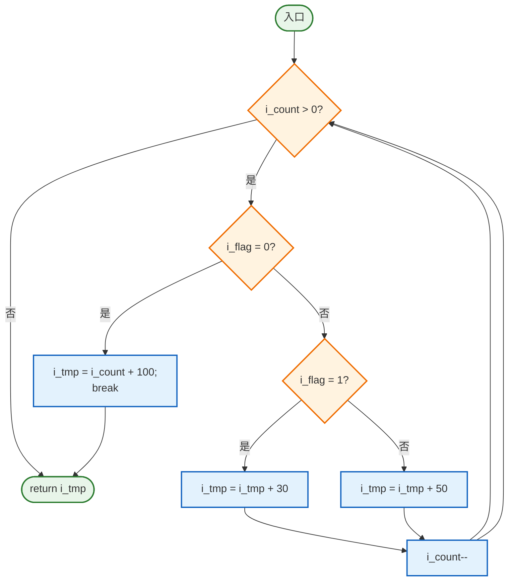

# 实验五 软件测试实验报告

## 一、实验目的与要求

1. 了解并区分软件测试的目标、类型与适用场景  
2. 掌握黑盒测试技术的核心概念、方法与测试用例设计  
3. 掌握白盒测试技术（结构化测试）的主要思想与实现方式  
4. 针对不同测试对象选择合适的策略，能够编写覆盖充分的测试用例

## 二、实验类型

设计性实验

## 三、实验原理及说明

### 3.1 黑盒（功能）测试

黑盒测试把被测程序看作不可见的“黑箱”，测试人员依据需求规格或用户故事来验证功能是否满足预期，而不考虑内部实现。典型方法包括等价类划分、边界值分析、判定表法等。本实验在 `DoWork` 函数的测试中强调通过输入条件组合验证外部可观察到的行为。

### 3.2 白盒（结构）测试

白盒测试基于对程序内部逻辑的了解，分析代码结构，按照语句覆盖、判定覆盖、条件覆盖、基本路径覆盖等准则设计用例。本实验在 `MyTest` 函数中采用基本路径测试，借助控制流图与环形复杂度确定最少独立路径集合，确保逻辑路径均被验证。

## 四、实验仪器

- 安装 Microsoft Word / Markdown 编辑器的计算机若干台  
- Python/VS Code/Cursor 等具备代码查看能力的开发环境  
- 计算器或脚本（用于验证运算结果）

## 五、实验内容

### 1. 根据要求设计测试用例

#### 1.1 被测函数 `DoWork`

```c
void DoWork(int x, int y, int z)
{
    int k = 0, j = 0;
    if ((x >= 3) && (z < 10)) {
        k = x * y - 1;   // 语句块1
        j = sqrt(k);
    }
    if ((x == 4) || (y > 5)) {
        j = x * y + 10;  // 语句块2
    }
    j = j % 3;           // 语句块3
}
```

#### 1.2 逻辑与覆盖需求分析

- 条件 A：`(x >= 3) && (z < 10)` —— 控制语句块1是否执行  
- 条件 B：`(x == 4) || (y > 5)` —— 控制语句块2是否执行  
- 语句块3必定执行，最终输出 `j mod 3`

为了满足“6 种逻辑覆盖”要求，同时兼顾判定、条件与条件组合覆盖，需设计至少 6 个输入组合，分别触发以下情况：

1. 仅 A 为真  
2. A 与 B 同时为真（B 由 `y > 5` 触发）  
3. A 与 B 同时为真（B 由 `x == 4` 触发）  
4. 仅 B 为真（由 `y > 5` 触发）  
5. 仅 B 为真（由 `x == 4` 触发）  
6. A、B 均为假

#### 1.3 测试用例设计

| 序号 | 输入 (x, y, z) | 覆盖目标 | 关键条件判定 | 预期计算过程 | 预期 `j` |
|------|---------------|----------|--------------|--------------|-----------|
| TC1 | (5, 1, 5) | 仅 A 为真 | `x>=3` 真、`z<10` 真；`x==4` 假、`y>5` 假 | 语句块1：`k=4`、`j=sqrt(4)=2`；块2跳过；`j=2%3` | 2 |
| TC2 | (3, 6, 5) | A 与 B 同真（`y>5`） | A 真、B 真 | 块1：`k=17`、`j≈4.12`（随后被覆盖）；块2：`j=28`；块3：`28%3` | 1 |
| TC3 | (4, 2, 5) | A 与 B 同真（`x==4`） | A 真、B 真 | 块1：`k=7`、`j≈2.64`（随后被覆盖）；块2：`j=18`；块3：`18%3` | 0 |
| TC4 | (3, 7, 12) | 仅 B 为真（`y>5`） | `z<10` 假 → A 假；`y>5` 真 → B 真 | 块1跳过；块2：`j=31`；块3：`31%3` | 1 |
| TC5 | (4, 1, 12) | 仅 B 为真（`x==4`） | `z<10` 假 → A 假；`x==4` 真 → B 真 | 块2：`j=14`；块3：`14%3` | 2 |
| TC6 | (2, 5, 12) | A、B 均为假 | `x>=3` 假、`x==4` 假、`y>5` 假 | 块1/2均跳过；`j` 仍为 0；块3：`0%3` | 0 |

> 以上 6 个用例覆盖了全部判定分支与两条 OR/AND 子条件的取值组合，可满足语句覆盖、分支覆盖与主要组合覆盖要求。

#### 1.4 `DoWork` 流程可视化

```mermaid
flowchart TD
    START([开始])
    A{ x ≥ 3 且 z < 10? }
    B{ x = 4 或 y > 5? }
    S1[语句块1: k = x*y-1;\nj = sqrt(k)]
    S2[语句块2: j = x*y + 10]
    S3[语句块3: j = j % 3]
    END([结束])

    START --> A
    A -->|是| S1
    A -->|否| B
    S1 --> B
    B -->|是| S2
    B -->|否| S3
    S2 --> S3
    S3 --> END

    classDef proc fill:#e3f2fd,stroke:#1565c0,stroke-width:2px;
    class START,END fill:#4caf50,stroke:#2e7d32,color:#fff;
    class A,B fill:#fff3e0,stroke:#ef6c00;
    class S1,S2,S3 proc
```

### 2. 基本路径测试设计（函数 `MyTest`）

#### 2.1 被测函数

```c
int MyTest(int i_count, int i_flag)
{
    int i_tmp = 0;
    while (i_count > 0) {
        if (0 == i_flag) {
            i_tmp = i_count + 100;
            break;
        } else {
            if (1 == i_flag) {
                i_tmp = i_tmp + 30;
            } else {
                i_tmp = i_tmp + 50;
            }
        }
        i_count--;
    }
    return i_tmp;
}
```

#### 2.2 控制流与环形复杂度

1. 构建控制流图：包含三个判定节点  
   - `while (i_count > 0)`  
   - `if (0 == i_flag)`  
   - 内层 `if (1 == i_flag)`  
2. 依据公式 `V(G) = P + 1`（P 为判定数），得 `V(G) = 3 + 1 = 4`。因此至少需要 4 条线性无关的基本路径。

#### 2.3 独立路径集合

| 路径 | 文字描述 | PATH 表达 |
|------|----------|-----------|
| P0 | 初始 `i_count <= 0`，不进入循环，直接返回 | 入口 → while 判定（假） → 返回 |
| P1 | 至少执行 1 次循环，外层 `if (i_flag == 0)` 为真，执行 `break` 跳出 | 入口 → while 真 → if 真 → break → 返回 |
| P2 | 循环执行若干次，`i_flag == 1`，走内层 then 分支并多次累加 30 | 入口 → while 真 → if 假 → 内层 if 真 → 回到 while → … → 返回 |
| P3 | 循环执行若干次，`i_flag` 既不为 0 也不为 1，走内层 else 分支并多次累加 50 | 入口 → while 真 → if 假 → 内层 if 假 → 回到 while → … → 返回 |

#### 2.4 基本路径测试用例

| 用例 | 输入 `(i_count, i_flag)` | 覆盖路径 | 预期输出 `i_tmp` | 说明 |
|------|------------------------|-----------|-----------------|------|
| MT1 | (0, 1) | P0 | 0 | 计数初值不大于 0，直接返回初始值 |
| MT2 | (3, 0) | P1 | 103 | 首次进入循环即匹配 `i_flag=0`，`i_tmp=3+100` 后 `break` |
| MT3 | (2, 1) | P2 | 60 | 循环两次：`i_tmp` 依次为 30、60，再因 `i_count` 归零退出 |
| MT4 | (2, 2) | P3 | 100 | 每次循环累加 50，共两次后退出 |

> MT2~MT4 让 while 循环至少执行一次，覆盖回边；P2、P3 还验证了 `i_count--` 对循环次数的影响。

#### 2.5 `MyTest` 控制流图



## 六、实验总结

- **测试策略**：通过将黑盒与白盒技术结合，既验证了功能需求，也确保了内部逻辑路径被充分执行。  
- **覆盖成效**：`DoWork` 用例实现条件/分支组合覆盖；`MyTest` 用例满足基本路径测试对独立路径的要求。  
- **经验体会**：先分析控制条件与可能路径，再反推输入数据，是构造高效测试用例的关键。分层描述（需求→逻辑→用例→期望）能显著提升文档可读性。  
- **改进方向**：后续可将测试用例参数化并结合自动化脚本运行，记录实测输出与期望输出的对比，形成可执行的回归测试套件。

## 七、实验完成情况

- **实验日期**：2025 年 11 月 17 日  
- **提交状态**：允许提交 / 可申请重做（按题目要求）  
- **附注**：本 Markdown 文档可直接导入 Word 或在线平台，亦可通过 `md2everything` 工具转化为其它格式。

