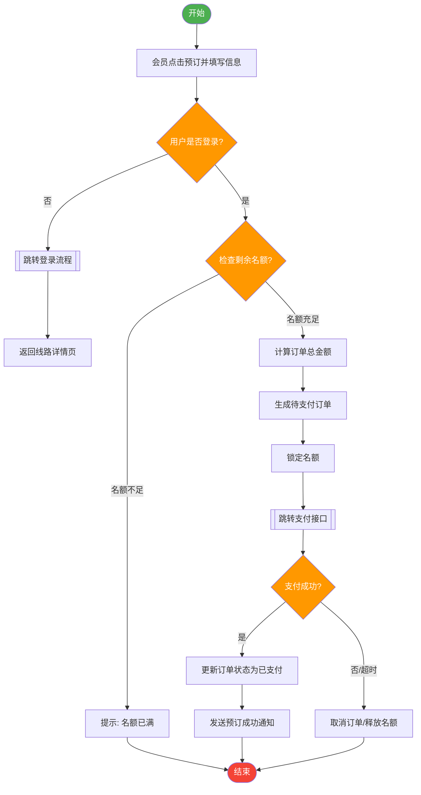
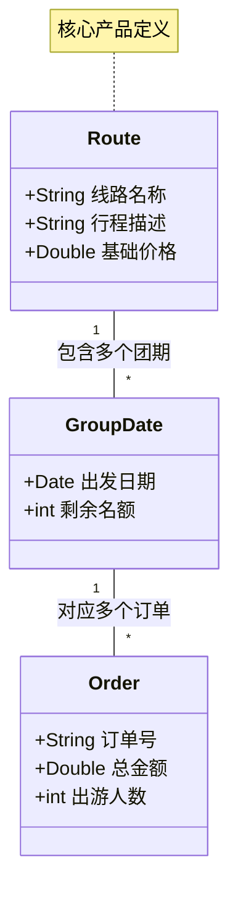

# 实验六 面向对象需求用例建模实验报告

## 一、实验目的与要求

1. **理解面向对象概念**：掌握面向对象方法学的要点和优点。
2. **掌握UML基础知识**：熟悉UML四种事务、四种关系、九种模型图以及不同模型图的运用场合。
3. **熟练运用UML工具建模**：掌握使用工具进行建模的技能。
4. **理解需求工程**：深入理解需求工程和需求分析概念定义、需求工程活动要素及过程、需求管理。
5. **掌握需求建模方法**：包括获取需求方法及问题定义、模型选择及构建、文档化软件需求定义模型及评审。
6. **构建用例模型**：基于实际问题域，从用户视角构建软件需求模型-用例模型（包括UML用例图、用例规约、补充规约和术语描述）。

## 二、实验类型

综合性实验

## 三、小组成员与分工

本次实验及课堂演示由四人协作完成，具体分工如下：

*   **陈星宇**：
    负责实验报告部分内容撰写（包括用例图设计与部分用例规约整理）、PPT 制作、课堂演示主讲。

*   **孙宜飞**：
    负责实验报告部分内容撰写（包括补充规约与术语表整理）、PPT 核心内容优化、课堂演示讲解。

*   **张凯**：
    负责前期面向对象建模与 UML 知识的梳理与储备，参与 PPT 内容组织，协助完成实验报告中用例规约与业务规则的编写。

*   **张昊铖**：
    负责整体知识框架的搭建与实验内容规划，统筹实验报告结构与逻辑框架，制定课堂演讲流程与内容定制，确保演示逻辑清晰、重点突出。

> **团队总结**：通过明确分工与高效协作，团队在有限时间内高质量完成了用例模型构建、文档撰写及课堂展示任务。

## 四、实验原理及说明

用例建模是目前业界广泛采用的需求建模技术。它通过对软件需求进行用例与参与者的识别，从用户视角描述软件系统要解决的业务问题。建立需求用例模型是需求分析的核心，它通过各种图形及符号，可视化地从各个侧面描述系统需求。面向对象的用例模型，由用例模型、补充规约和术语表一起组成。

## 五、实验内容：Sunny旅游管理系统需求建模

### 1. 问题域描述

Sunny旅游管理系统旨在为一家旅游公司提供一套综合性的在线旅游服务平台。系统需要支持前端游客/会员的在线浏览、预订服务，以及后端管理员对旅游产品、订单和用户的管理功能。系统核心目标是提升旅游产品销售效率，优化用户预订体验。

### 2. 参与者识别 (Actors)

根据需求分析，识别出以下核心参与者：

*   **游客 (Visitor)**：未登录的用户，可以浏览信息但不能预订。
*   **会员 (Member)**：注册并登录的用户，可以预订产品、管理个人订单。
*   **系统管理员 (Admin)**：负责系统后台维护，包括发布产品、处理订单、管理用户。

### 3. 用例模型 (Use Case Model)

#### 3.1 核心用例识别

| 参与者 | 核心用例 |
| :--- | :--- |
| **游客** | 浏览旅游线路、搜索旅游产品、注册/登录 |
| **会员** | 预订旅游线路、支付订单、查看历史订单、修改个人信息 |
| **管理员** | 发布旅游线路、修改线路信息、删除线路、订单处理、会员管理 |

#### 3.2 系统总体用例图 (Visualized by Mermaid)

以下展示了Sunny旅游管理系统的顶层用例视图，描绘了参与者与系统功能之间的交互边界。

```mermaid
graph LR
    %% 定义参与者节点样式
    classDef actor fill:#f9f,stroke:#333,stroke-width:2px;
    classDef usecase fill:#e1f5fe,stroke:#0277bd,stroke-width:2px,rx:10,ry:10;

    subgraph Actors [参与者]
        direction TB
        Visitor((游客)):::actor
        Member((会员)):::actor
        Admin((管理员)):::actor
    end

    subgraph System [Sunny旅游管理系统]
        direction TB
        
        %% 游客功能
        UC1(浏览/搜索旅游线路):::usecase
        UC2(用户注册):::usecase
        UC3(用户登录):::usecase
        
        %% 会员功能
        UC4(预订旅游产品):::usecase
        UC5(订单支付):::usecase
        UC6(个人中心管理):::usecase
        
        %% 管理员功能
        UC7(旅游线路管理):::usecase
        UC8(订单处理):::usecase
        UC9(会员管理):::usecase
    end

    %% 关系连接
    Visitor --> UC1
    Visitor --> UC2
    Visitor --> UC3

    Member --> UC1
    Member --> UC4
    Member --> UC6
    
    %% 包含关系示例
    UC4 -.->|<< include >>| UC3
    UC4 -.->|<< include >>| UC5

    Admin --> UC7
    Admin --> UC8
    Admin --> UC9
    
    %% 泛化关系：会员也是一种游客（继承游客的浏览功能）
    Member -.-|> Visitor
```

### 4. 用例规约 (Use Case Specification)

选取核心用例 **"预订旅游线路"** 进行详细描述。

#### 4.1 用例描述

*   **用例名称**：预订旅游线路
*   **用例ID**：UC-04
*   **参与者**：会员
*   **前置条件**：用户已登录，且浏览到感兴趣的旅游线路。
*   **后置条件**：系统生成待支付订单，并在数据库中扣除相应名额。

#### 4.2 事件流 (Flow of Events)

**基本流 (Basic Flow)**：

1.  会员在旅游线路详情页点击"立即预订"。
2.  系统显示预订信息填写页面（包括出发日期、人数、联系人信息）。
3.  会员输入相关信息并提交。
4.  系统验证剩余名额充足。
5.  系统计算总金额并生成订单。
6.  系统跳转至支付页面。

**备选流 (Alternative Flow)**：

*   4a. 如果剩余名额不足：系统提示"名额已满"，返回详情页，用例结束。
*   5a. 如果会员取消提交：系统返回详情页，不生成订单。

#### 4.3 业务流程可视化 (Visualized by Mermaid)

为了更清晰地展示"预订旅游线路"的逻辑判断过程，使用流程图描述如下：



### 5. 补充规约 (Supplementary Specification)

补充规约定义了用例模型中未能直接体现的非功能性需求。

| 类别 | 需求描述 |
| :--- | :--- |
| **可靠性** | 系统应支持 7x24 小时运行，年可用性不低于 99.9%。 |
| **性能** | 首页加载时间不超过 2 秒；支持 1000 用户并发访问；订单生成响应时间小于 1 秒。 |
| **安全性** | 用户密码必须加密存储（如SHA-256）；支付环节需使用 HTTPS 加密传输；敏感数据需脱敏展示。 |
| **可维护性** | 代码应符合 PEP8 规范（如果是Python开发），模块间耦合度低，便于后期功能扩展。 |

### 6. 术语表 (Glossary)

为确保项目组内部及与客户沟通时的语义一致性，定义以下术语：

| 术语 | 定义/说明 |
| :--- | :--- |
| **线路 (Route)** | 包含目的地、行程天数、交通方式、住宿标准等信息的旅游产品组合。 |
| **团期 (Group Date)** | 某一条旅游线路具体的出发日期集合。 |
| **单房差 (Single Supplement)** | 旅游者要求单独住宿一间客房时需补交的费用。 |
| **订单 (Order)** | 会员购买旅游产品的交易记录，包含订单号、状态、金额等属性。 |

#### 术语关系示意图



## 六、实验总结

本次实验以"Sunny旅游管理系统"为背景，通过小组协作完成了从需求分析到用例建模的全过程。

1.  **建模体会**：
    *   用例图有效地划定了系统的功能边界，明确了"谁（参与者）"可以"做什么（用例）"。
    *   在绘制 Mermaid 图表的过程中，我们将抽象的业务逻辑具象化，发现了初期讨论中遗漏的"未登录跳转"和"库存回滚"等细节流程。
    *   分层建模（用例图 -> 用例规约 -> 补充规约）的方法让我们既关注了宏观架构，又没有忽视具体的业务规则。

2.  **工具应用**：
    *   熟练掌握了 Markdown 编写文档的技巧，特别是结合 Mermaid 语法直接在文档中渲染 UML 图，极大地提高了文档的维护效率和版本管理能力。相比传统的 Visio 截图，代码化绘图更易于修改和协作。

3.  **团队协作**：
    *   正如分工所述，我们四人小组（陈星宇、孙宜飞、张凯、张昊铖）发挥各自特长。张昊铖同学搭建的框架让工作有序进行，张凯同学的前期调研为规约编写提供了扎实基础，陈星宇和孙宜飞同学则在文档撰写与演示制作上保证了最终交付物的质量。这种分工模式模拟了真实软件开发中的团队合作场景。

---
**实验日期**：2025年11月21日
**报告提交人**：陈星宇

