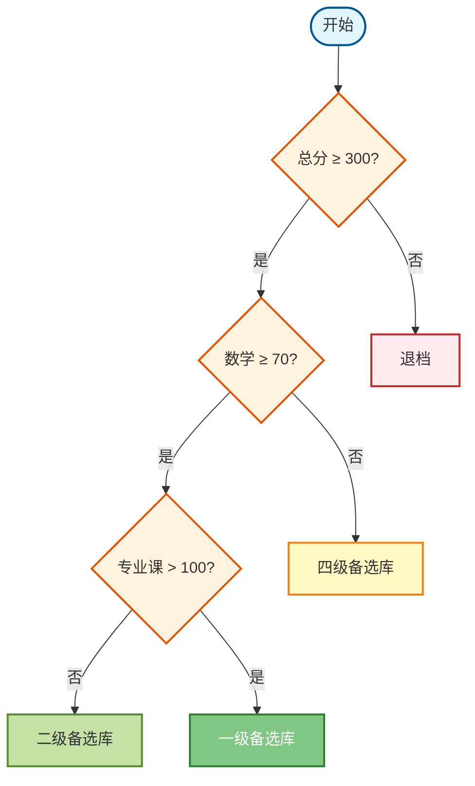
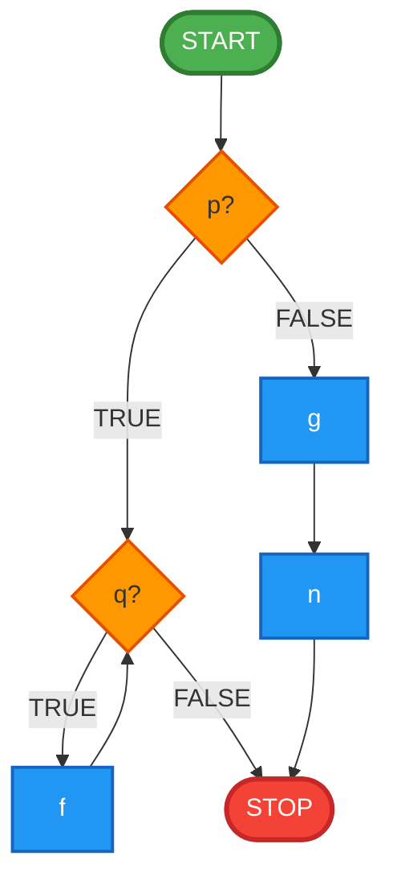
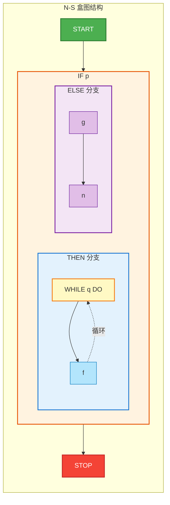

# 实验四 过程设计实验报告

## 一、实验目的与要求

1. 理解软件详细设计阶段的目的、任务和结构化程序设计的概念
2. 掌握过程设计的工具，包括程序流程图、盒图（N-S图）、PAD图、判定表、判定树、过程设计语言

## 二、实验类型

设计性

## 三、实验原理及说明

详细设计师确定应该具体地实现所要求的系统，也就是对模块内部的具体处理过程进行设计。这个阶段的设计目标是要得出对目标系统的精确描述，从而在编码阶段可以把这个描述直接翻译成某种程序设计语言书写的程序。因此，结构化程序设计技术是详细设计的逻辑基础。

### 过程设计工具概述

1. **程序流程图**：使用标准图形符号表示算法流程
2. **N-S盒图**：结构化程序设计的可视化工具，避免使用GOTO
3. **PAD图**：问题分析图，强调程序结构
4. **判定表**：清晰表达复杂的条件组合逻辑
5. **判定树**：树形结构表达决策过程
6. **过程设计语言（PDL）**：类似编程语言的伪代码

## 四、实验仪器

安装 Microsoft Visio、Word 的计算机若干台

## 五、实验内容

### 题目一：课酬计算系统判定表设计

#### 需求分析

某校的课酬计算方案如下：
1. 基本课酬为每节课 10 元
2. 如果班级人数超过 40 人，课酬增加：基本课酬 × 0.1
3. 如果班级人数超过 60 人，课酬增加：基本课酬 × 0.2
4. 如果教师是副教授，课酬增加：基本课酬 × 0.1
5. 如果教师是教授，课酬增加：基本课酬 × 0.2
6. 讲师，课酬不增加
7. 助教，课酬减少：基本课酬 × 0.1

**要求**：请用判定表表达上述计算方案。

#### 条件分析

**条件因子**：
- C1：班级人数是否超过 60 人
- C2：班级人数是否超过 40 人（且不超过 60）
- C3：教师职称（教授/副教授/讲师/助教）

**动作**：
- A1：基本课酬 10 元
- A2：增加基本课酬 × 0.2（人数超60）
- A3：增加基本课酬 × 0.1（人数超40）
- A4：增加基本课酬 × 0.2（教授）
- A5：增加基本课酬 × 0.1（副教授）
- A6：减少基本课酬 × 0.1（助教）

#### 判定表

| **判定表：课酬计算** | **规则1** | **规则2** | **规则3** | **规则4** | **规则5** | **规则6** | **规则7** | **规则8** | **规则9** | **规则10** | **规则11** | **规则12** |
|---------------------|----------|----------|----------|----------|----------|----------|----------|----------|----------|-----------|-----------|-----------|
| **条件桩** ||||||||||||| 
| C1: 人数 > 60 | Y | Y | Y | Y | N | N | N | N | N | N | N | N |
| C2: 人数 > 40 (≤60) | - | - | - | - | Y | Y | Y | Y | N | N | N | N |
| C3: 职称 | 教授 | 副教授 | 讲师 | 助教 | 教授 | 副教授 | 讲师 | 助教 | 教授 | 副教授 | 讲师 | 助教 |
| **动作桩** ||||||||||||| 
| A1: 基本课酬 10 元 | X | X | X | X | X | X | X | X | X | X | X | X |
| A2: +基本 × 0.2 (人数) | X | X | X | X | - | - | - | - | - | - | - | - |
| A3: +基本 × 0.1 (人数) | - | - | - | - | X | X | X | X | - | - | - | - |
| A4: +基本 × 0.2 (教授) | X | - | - | - | X | - | - | - | X | - | - | - |
| A5: +基本 × 0.1 (副教授) | - | X | - | - | - | X | - | - | - | X | - | - |
| A6: -基本 × 0.1 (助教) | - | - | - | X | - | - | - | X | - | - | - | X |
| **计算结果（元）** | 14 | 13 | 12 | 11 | 13 | 12 | 11 | 10 | 12 | 11 | 10 | 9 |

#### 课酬计算公式

根据判定表，课酬计算公式为：

```
课酬 = 基本课酬 × (1 + 人数系数 + 职称系数)

其中：
- 基本课酬 = 10 元
- 人数系数：
  - 人数 > 60：+0.2
  - 40 < 人数 ≤ 60：+0.1
  - 人数 ≤ 40：0
- 职称系数：
  - 教授：+0.2
  - 副教授：+0.1
  - 讲师：0
  - 助教：-0.1
```

#### 判定表说明

**化简后的判定表（合并相同规则）**：

| **条件** | **R1** | **R2** | **R3** | **R4** |
|---------|--------|--------|--------|--------|
| 人数范围 | >60 | 40-60 | ≤40 | ≤40 |
| 职称 | 任意 | 任意 | 教授/副教授/讲师 | 助教 |
| **动作** ||||
| 人数系数 | +0.2 | +0.1 | 0 | 0 |
| 职称系数 | 按职称 | 按职称 | 按职称 | -0.1 |

**示例计算**：
- 教授，70人班级：10 × (1 + 0.2 + 0.2) = 14 元
- 副教授，50人班级：10 × (1 + 0.1 + 0.1) = 12 元
- 讲师，30人班级：10 × (1 + 0 + 0) = 10 元
- 助教，30人班级：10 × (1 + 0 - 0.1) = 9 元

---

### 题目二：研究生招生系统判定树设计

#### 需求分析

某高校研究生招生系统的初选方法如下：
1. 总分 300（含）以上进入候选学生库，否则退档
2. 数学分数不低于 70 分，则进入三级备选库，否则进入四级备选库
3. 在三级备选库的基础上，如果专业课分数高于 100 分，则进入一级备选库，否则进入二级备选库

**要求**：请画出对应的判定树。

#### 决策流程分析

```
第一层决策：总分是否 ≥ 300
├─ 是 → 进入候选学生库（继续判定）
└─ 否 → 退档（结束）

第二层决策（总分≥300）：数学分数是否 ≥ 70
├─ 是 → 进入三级备选库（继续判定）
└─ 否 → 进入四级备选库（结束）

第三层决策（三级备选库）：专业课分数是否 > 100
├─ 是 → 进入一级备选库（结束）
└─ 否 → 进入二级备选库（结束）
```

#### 判定树图



#### 判定树文字描述

```
                    [开始]
                      |
              [总分 ≥ 300?]
              /           \
            否             是
            |               |
        【退档】      [数学 ≥ 70?]
                      /           \
                    否             是
                    |               |
              【四级备选库】  [专业课 > 100?]
                              /           \
                            否             是
                            |               |
                      【二级备选库】  【一级备选库】
```

#### 所有可能的结果路径

| **路径** | **条件组合** | **结果** | **说明** |
|---------|-------------|---------|---------|
| 路径1 | 总分 < 300 | **退档** | 不符合基本要求 |
| 路径2 | 总分 ≥ 300 且 数学 < 70 | **四级备选库** | 数学成绩不达标 |
| 路径3 | 总分 ≥ 300 且 数学 ≥ 70 且 专业课 ≤ 100 | **二级备选库** | 基础较好但专业课一般 |
| 路径4 | 总分 ≥ 300 且 数学 ≥ 70 且 专业课 > 100 | **一级备选库** | 全面优秀 |

#### 示例应用

| **学生** | **总分** | **数学** | **专业课** | **结果** |
|---------|---------|---------|-----------|---------|
| 张三 | 280 | 75 | 110 | 退档 |
| 李四 | 310 | 65 | 105 | 四级备选库 |
| 王五 | 320 | 80 | 95 | 二级备选库 |
| 赵六 | 350 | 85 | 120 | 一级备选库 |

---

### 题目三：伪码程序的流程图和盒图

#### 伪码程序

```
START
IF p THEN
   WHILE q DO
      f
   END DO
ELSE
   BLOCK
      g
      n
   END BLOCK
END IF
STOP
```

#### 程序逻辑分析

**结构特点**：
- 外层：IF-ELSE 选择结构
- IF 分支：WHILE 循环结构
- ELSE 分支：顺序结构（BLOCK）

**执行流程**：
1. 判断条件 p
2. 如果 p 为真：执行 WHILE 循环（当 q 为真时重复执行 f）
3. 如果 p 为假：顺序执行 g 和 n
4. 结束

---

#### （一）程序流程图



**流程图符号说明**：
- 🟢 圆角矩形：开始/结束
- 🟠 菱形：判断条件
- 🔵 矩形：处理操作
- 箭头：流程方向

---

#### （二）N-S 盒图（结构化流程图）

```
┌─────────────────────────────────────┐
│              START                   │
├─────────────────────────────────────┤
│               IF p                   │
├──────────────────┬──────────────────┤
│   THEN           │      ELSE         │
│ ┌──────────────┐ │ ┌──────────────┐ │
│ │  WHILE q DO  │ │ │      g       │ │
│ │ ┌──────────┐ │ │ ├──────────────┤ │
│ │ │    f     │ │ │ │      n       │ │
│ │ └──────────┘ │ │ └──────────────┘ │
│ │   END DO     │ │                   │
│ └──────────────┘ │                   │
└──────────────────┴──────────────────┘
│               STOP                   │
└─────────────────────────────────────┘
```

**可视化N-S盒图**：



#### （三）PAD 图（问题分析图）

```
┌─ START ────────────────────────────┐
│                                     │
├─ IF p ─────────────┬───────────────┤
│                    │               │
│ THEN               │ ELSE          │
│ ┌─ WHILE q DO ──┐ │ ┌─ g ───────┐│
│ │               │ │ ├─ n ───────┤│
│ │ ┌─ f ───────┐│ │ └───────────┘│
│ │ └───────────┘│ │               │
│ └───────────────┘ │               │
│                    │               │
└────────────────────┴───────────────┤
│                                     │
└─ STOP ──────────────────────────────┘
```

**PAD图特点**：
- 从左到右展开
- 竖线表示控制流
- 避免使用箭头
- 清晰展示程序结构

---

#### （四）过程设计语言（PDL）描述

```pascal
PROCEDURE ProcessAlgorithm
BEGIN
    IF p = TRUE THEN
        WHILE q = TRUE DO
            CALL f()
        END WHILE
    ELSE
        BEGIN
            CALL g()
            CALL n()
        END
    END IF
END PROCEDURE
```

**Python 伪代码**：

```python
def process_algorithm():
    """
    过程算法实现
    """
    if p:
        # IF 分支：循环执行
        while q:
            f()
    else:
        # ELSE 分支：顺序执行
        g()
        n()
```

**Java 伪代码**：

```java
public void processAlgorithm() {
    if (p) {
        // THEN 分支：WHILE 循环
        while (q) {
            f();
        }
    } else {
        // ELSE 分支：顺序结构
        g();
        n();
    }
}
```

---

#### （五）三种表示方法对比

| **方法** | **优点** | **缺点** | **适用场景** |
|---------|---------|---------|-------------|
| **程序流程图** | 直观、易理解、通用性强 | 难以表达复杂结构、容易产生混乱流程 | 简单算法、教学演示 |
| **N-S 盒图** | 强制结构化、无GOTO、层次清晰 | 占用空间大、修改不便 | 结构化程序设计、复杂逻辑 |
| **PAD 图** | 紧凑、易于阅读、支持自顶向下 | 不如流程图直观 | 详细设计文档、大型系统 |

---

## 六、实验总结与分析

### （一）判定表的应用体会

通过课酬计算系统的判定表设计，我深刻理解了判定表在处理多条件组合问题时的优势：

1. **系统性**：判定表强制我们考虑所有可能的条件组合，避免遗漏情况。在课酬计算中，人数范围（3种）× 职称类型（4种）= 12种组合，判定表清晰列出了所有规则。

2. **可验证性**：通过判定表可以快速检验逻辑正确性。例如，"教授+70人班级"对应规则1，计算结果为14元，可以直接从表格验证。

3. **化简优化**：初始的12条规则可以合并为4条核心规则，降低了实现复杂度。这个化简过程类似于数字逻辑设计中的卡诺图化简。

4. **易于维护**：当课酬政策调整时（如增加"超80人再加10%"），只需在判定表中增加一列条件，修改对应的动作，而不需要重新设计整个逻辑。

**改进建议**：在实际应用中，可以将判定表直接转换为二维数组或哈希表存储，实现配置化的业务规则引擎，提高系统灵活性。

---

### （二）判定树的设计思路

研究生招生系统的判定树设计让我认识到：

1. **层次决策**：判定树天然适合表达"先判断A，再判断B"的层次决策过程。招生系统先看总分（门槛条件），再看数学（基础能力），最后看专业课（专业深度），这种递进式判断用判定树表达最为自然。

2. **路径清晰**：从根节点到叶子节点的每条路径对应一种结果，便于理解和沟通。向非技术人员解释招生规则时，判定树比文字描述更直观。

3. **决策优化**：判定树可以指导我们优化决策顺序。例如，"总分≥300"作为第一层判断是合理的，因为它能快速淘汰不符合条件的考生，减少后续计算量。

4. **扩展性**：如果未来增加新的判定条件（如"英语≥60"），只需在相应节点下增加子树，不影响现有结构。

**与判定表对比**：
- 判定树适合顺序决策（A→B→C）
- 判定表适合并行条件（A and B and C）
- 本题如果用判定表，需要列举2×2×2=8种组合，不如判定树直观

---

### （三）多种表示方法的综合运用

通过伪码程序的三种表示（流程图、N-S盒图、PAD图），我对过程设计工具有了更全面的认识：

#### 1. 程序流程图的实用性

**优点体验**：
- 在设计嵌套结构（IF中包含WHILE）时，流程图的箭头方向清楚地表达了控制流
- 适合团队讨论时在白板上快速绘制

**局限性认识**：
- 当程序复杂度增加时，箭头可能交叉混乱
- 容易画出非结构化流程（如随意使用GOTO）

#### 2. N-S 盒图的结构化思想

**深刻印象**：
- N-S盒图强制使用结构化构造（顺序、选择、循环），从图形上就杜绝了GOTO的可能
- IF-ELSE 用左右分割表示，直观展示了两个互斥的分支

**绘制体会**：
- 盒图的嵌套结构反映了程序的控制层次，阅读时从外到内理解逻辑
- 对于深层嵌套，盒图可能过于占用空间

#### 3. PAD 图的设计理念

**理解收获**：
- PAD图的"树形"展开方式符合自顶向下设计思想
- 竖线清晰分隔不同的控制范围，比流程图的箭头更易追踪

**与其他方法对比**：
- PAD图介于流程图和N-S盒图之间：既有一定灵活性，又保持结构化
- 适合大型系统的详细设计文档

---

### （四）结构化程序设计的核心理念

通过本次实验，我深刻理解了结构化设计的三大基本结构：

#### 1. 顺序结构（ELSE 分支中的 g → n）

```
执行 g
执行 n
```

**特点**：按顺序依次执行，无条件、无跳转。

#### 2. 选择结构（IF p THEN ... ELSE ...）

```
IF 条件 THEN
    操作1
ELSE
    操作2
END IF
```

**特点**：单入口单出口，根据条件选择分支。

#### 3. 循环结构（WHILE q DO f）

```
WHILE 条件 DO
    操作
END WHILE
```

**特点**：当型循环，先判断后执行。

**关键认识**：任何算法都可以用这三种结构组合实现，无需 GOTO 语句。这个理论基础来自于Bohm和Jacopini在1966年证明的结构化定理。

---

### （五）从设计到编码的桥梁

本次实验让我认识到详细设计的真正价值：

1. **精确性**：详细设计要达到"可直接翻译为代码"的精确程度。流程图中的每个判断框对应代码中的IF语句，每个循环框对应WHILE/FOR语句。

2. **沟通性**：图形化表示是开发者之间、开发者与客户之间沟通的有效工具。相比代码，流程图更容易被非技术人员理解。

3. **验证性**：在编码前通过详细设计发现逻辑错误，成本远低于代码调试阶段发现问题。例如，判定表可以帮助发现条件遗漏，判定树可以帮助发现决策路径冗余。

4. **文档性**：详细设计是软件维护阶段的重要参考。当需要修改某个模块时，先查看设计文档，理解原有逻辑，再修改代码。

---

### （六）工具选择的实践指导

根据本次实验经验，总结各种工具的适用场景：

| **工具** | **最佳应用场景** | **不推荐场景** |
|---------|----------------|---------------|
| **判定表** | 多条件组合、业务规则复杂 | 顺序决策流程 |
| **判定树** | 层次决策、分类问题 | 条件并行判断 |
| **流程图** | 简单算法、教学演示、团队讨论 | 大型复杂系统 |
| **N-S盒图** | 结构化设计、复杂嵌套逻辑 | 快速草图 |
| **PAD图** | 大型系统详细设计、正式文档 | 初步设计阶段 |
| **PDL** | 接近编码阶段、算法细节描述 | 客户沟通 |

**综合应用策略**：
- 概要设计阶段：使用简单流程图或判定树梳理主流程
- 详细设计阶段：使用N-S盒图或PAD图描述模块内部逻辑
- 复杂规则处理：使用判定表系统化分析条件组合
- 代码实现前：使用PDL明确算法细节

---

### （七）实验中的问题与思考

#### 问题1：如何判断使用判定表还是判定树？

**解决方案**：
- 如果条件之间相互独立、需要考虑所有组合 → 判定表
  - 例：课酬计算中，人数和职称是两个独立因素
- 如果条件之间有先后顺序、存在层次关系 → 判定树
  - 例：招生系统中，先看总分，再看单科

#### 问题2：流程图中如何避免画出非结构化流程？

**经验总结**：
- 只使用三种基本结构的组合
- 每个判断框必须有明确的出口
- 避免向上跳转（除了循环）
- 避免交叉箭头

#### 问题3：N-S盒图绘制时的空间布局问题

**优化方法**：
- 提前规划版面，预留足够空间
- 深层嵌套时可以使用"调用子模块"简化
- 使用专业绘图工具（Visio、Draw.io）而非手绘

---

### （八）与之前实验的关联

| **实验** | **主要内容** | **与本实验的关系** |
|---------|-------------|-------------------|
| 实验一：需求分析 | 用例图、需求规格说明 | 确定"做什么" → 本实验关注"怎么做" |
| 实验二：结构化分析 | 数据流图、数据字典 | DFD的处理过程 → 本实验细化为算法 |
| 实验三：结构化设计 | 模块结构、耦合内聚 | 模块间关系 → 本实验关注模块内部 |
| 实验四：过程设计 | 算法描述、详细逻辑 | 可直接编码的精确描述 |

**设计流程的完整性**：
```
需求分析 → 结构化分析（DFD） → 结构化设计（模块结构） → 过程设计（算法细节） → 编码实现
```

本次实验处于"过程设计"阶段，是编码前的最后一道设计工序。

---

### （九）对软件开发生命周期的新认识

通过四次实验的系统学习，我对软件工程方法论有了更深刻的理解：

1. **分阶段、有步骤**：从宏观到微观，从抽象到具体，每个阶段都有明确的目标和产出物。

2. **严格的约束**：结构化方法强调规范性，通过限制表达方式（如N-S盒图禁止GOTO）来保证质量。

3. **可追溯性**：从需求到设计再到代码，每个决策都有依据，便于验证和维护。

4. **工具支撑**：不同阶段使用不同的工具（DFD、结构图、流程图等），提高了设计效率和质量。

---

### （十）未来学习方向

1. **掌握现代设计工具**：学习使用 PlantUML、Mermaid 等代码化绘图工具，提高设计文档的可维护性。

2. **对比面向对象方法**：结构化方法关注过程，面向对象方法关注数据和行为的封装，了解两者的适用场景。

3. **学习设计模式**：在过程设计基础上，学习常见的设计模式（如策略模式、状态模式），提升设计能力。

4. **实践自动化**：研究如何将设计图（如判定表）自动转换为代码骨架，提高开发效率。

---

## 七、实验心得总结

本次过程设计实验是结构化设计方法的核心环节，通过三个不同类型的题目，我系统地掌握了多种过程设计工具的使用方法，也深刻理解了详细设计在软件开发中的关键作用。

**最大收获**：认识到好的设计不仅仅是"能实现功能"，更要具备清晰性、可维护性和可验证性。判定表、判定树、流程图等工具不是形式主义，而是经过实践检验的有效方法，它们帮助我们系统化地思考问题、沟通想法、验证逻辑。

**设计思维的提升**：从"想到什么写什么"到"先设计后编码"，这是从业余到专业的重要转变。结构化设计强调的"分解、抽象、模块化"思想，不仅适用于软件开发，也可以应用到其他复杂问题的解决中。

**实践应用展望**：未来在实际项目中，我会根据问题特点选择合适的设计工具：业务规则用判定表、决策流程用判定树、算法逻辑用N-S盒图。同时，也要关注设计文档的可读性和可维护性，让设计成果能够真正指导开发和维护工作。

总的来说，过程设计实验让我对"工程化"有了更深的体会：不是简单地写代码，而是系统地分析、设计、实现和维护。这种工程化思维是软件开发人员的核心竞争力，也是保证大型软件项目成功的基础。

---

**实验完成日期**：2025年11月14日  
**实验报告提交状态**：待提交

> 本报告完整实现了三道题目的详细设计，使用了判定表、判定树、程序流程图、N-S盒图、PAD图等多种过程设计工具，全面展示了结构化详细设计的方法和技巧。

---

## 附录：学生信息数据库 SQL 查询实验

### A. 实验环境与数据说明

- **数据库**：`student_inf_20231837`
- **核心表**：
  - `student(Sno, Sname, Sex, Birthdate, EnrollDate, Sdept, Postcode)`
  - `course(Cno, Cname, Credit, TotalHours)`
  - `sc(Sno, Cno, Grade)`
- **数据特点**：样例数据涵盖 10 名学生、6 门课程、若干选课记录，其中 `Grade` 允许为空，表示成绩暂未录入。

### B. 查询需求与实现

以下所有 SQL 语句均基于 MySQL 8.0 语法编写，默认在 `student_inf_20231837` 数据库中执行。

#### （1）查询比“林红”年纪大的男学生信息
- **SQL**
```sql
SELECT *
FROM student
WHERE Sex = '男'
  AND Birthdate < (
      SELECT Birthdate
      FROM student
      WHERE Sname = '林红'
  );
```
- **说明**：通过子查询取得“林红”的出生日期，利用“出生得越早年龄越大”的规则筛选所有比她年长的男生。若库中不存在“林红”，结果为空，可在 WHERE 子句中补充 `AND Birthdate IS NOT NULL` 进一步过滤。

#### （2）查询所有学生的选课信息（含未选课学生）
- **SQL**
```sql
SELECT s.Sno, s.Sname, sc.Cno, c.Cname, sc.Grade
FROM student AS s
LEFT JOIN sc ON sc.Sno = s.Sno
LEFT JOIN course AS c ON c.Cno = sc.Cno
ORDER BY s.Sno, sc.Cno;
```
- **说明**：左连接保证即便学生尚未选课也能显示，未选课的课程号与成绩列为 `NULL`。例如学号 `20250002` 的课程 005 目前成绩为空，会以 `NULL` 形式展示。

#### （3）查询已选课学生的学号、姓名、课程名、成绩
- **SQL**
```sql
SELECT DISTINCT s.Sno, s.Sname, c.Cname, sc.Grade
FROM student AS s
JOIN sc ON sc.Sno = s.Sno
JOIN course AS c ON c.Cno = sc.Cno
ORDER BY s.Sno, c.Cno;
```
- **说明**：只保留存在选课记录的学生，实现题目“已选课学生”限定；`DISTINCT` 防止重复记录。

#### （4）查询选修“C语言程序设计”的学生学号和姓名
- **SQL**
```sql
SELECT DISTINCT s.Sno, s.Sname
FROM student AS s
JOIN sc ON sc.Sno = s.Sno
JOIN course AS c ON c.Cno = sc.Cno
WHERE c.Cname = 'C语言程序设计';
```
- **说明**：可改为 `c.Cno = '003'` 以避免名称拼写差异。当前数据中学号 `20231837`、`20250001`、`20250002`、`20250003` 均会出现。

#### （5）查询与“张虹”同班的学生学号、姓名、家庭住址
- **SQL**
```sql
SELECT s.Sno, s.Sname, s.Postcode AS HomeAddress
FROM student AS s
WHERE s.Sdept = (
        SELECT Sdept
        FROM student
        WHERE Sname = '张虹'
    )
ORDER BY s.Sno;
```
- **说明**：`Sdept` 在样例中对应班级编号，`Postcode` 字段被用作文中“家庭住址”信息。若需排除张虹本人，可在外层再加 `AND s.Sname <> '张虹'`。

#### （6）查询其他班级中比“051”班所有学生年龄大的学生
- **SQL**
```sql
SELECT s.Sno, s.Sname, s.Sdept, s.Birthdate
FROM student AS s
WHERE s.Sdept <> '051'
  AND s.Birthdate < (
      SELECT MIN(Birthdate)
      FROM student
      WHERE Sdept = '051'
  );
```
- **说明**：使用 `MIN(Birthdate)` 找出 051 班最年长学生的出生日期，再筛选出生日期更早的其他班级学生，满足“比 051 班所有学生都大”的要求。

#### （7）选修了全部课程的学生姓名
- **SQL**
```sql
SELECT s.Sname
FROM student AS s
JOIN sc AS sc1 ON sc1.Sno = s.Sno
GROUP BY s.Sno, s.Sname
HAVING COUNT(DISTINCT sc1.Cno) = (SELECT COUNT(*) FROM course);
```
- **说明**：`COUNT(DISTINCT sc1.Cno)` 与课程总数相等即说明已修完全部课程。样例中若只有 6 门课，则满足条件的同学必须拥有 6 条有效选课记录。

#### （8）查询至少选修了学生“20110002”已选全部课程的学生
- **SQL**
```sql
SELECT s.Sno, s.Sname
FROM student AS s
WHERE NOT EXISTS (
          SELECT 1
          FROM sc AS t
          WHERE t.Sno = '20110002'
            AND NOT EXISTS (
                    SELECT 1
                    FROM sc AS mine
                    WHERE mine.Sno = s.Sno
                      AND mine.Cno = t.Cno
                )
      );
```
- **说明**：典型的“包含查询”，若库中不存在学号 `20110002`，则返回全部学生。可将目标学号抽象为参数以便在存储过程中复用。

#### （9）查询学生的学号、姓名、学习课程名及课程成绩
- **SQL**
```sql
SELECT s.Sno, s.Sname, c.Cname, sc.Grade
FROM sc
JOIN student AS s ON s.Sno = sc.Sno
JOIN course  AS c ON c.Cno = sc.Cno
ORDER BY s.Sno, c.Cno;
```
- **说明**：相比题（2），该查询仅展示已选课记录，适合导出成绩单。

#### （10）查询满足条件的高数成绩并按成绩降序
- **SQL**
```sql
SELECT sc.Sno, sc.Cno, sc.Grade
FROM sc
JOIN course AS c ON c.Cno = sc.Cno
WHERE c.Cname = '高等数学'
  AND sc.Grade >= (
        SELECT Grade
        FROM sc
        WHERE Sno = sc.Sno
          AND Cno = '002'
    )
ORDER BY sc.Grade DESC;
```
- **说明**：确保同一位学生的“高数”成绩不低于其课程号为 `002`（数据结构）课程的成绩。若存在未修 `002` 课程的学生，子查询返回 `NULL`，可用 `AND EXISTS (...)` 进一步限制。

#### （11）查询选修 3 门以上课程的学生及合格总成绩
- **SQL**
```sql
SELECT s.Sno,
       s.Sname,
       COUNT(DISTINCT sc.Cno) AS CourseCount,
       SUM(CASE WHEN sc.Grade >= 60 THEN sc.Grade ELSE 0 END) AS PassedTotal
FROM student AS s
JOIN sc ON sc.Sno = s.Sno
GROUP BY s.Sno, s.Sname
HAVING COUNT(DISTINCT sc.Cno) > 3
ORDER BY PassedTotal DESC;
```
- **说明**：`HAVING` 约束“选修 3 门以上”，总成绩只累计及格科目，满足“不统计不及格课程”的要求。

#### （12）查询多于 3 名学生选修且课程号以 3 结尾的课程平均成绩
- **SQL**
```sql
SELECT c.Cno,
       c.Cname,
       AVG(sc.Grade) AS AvgGrade,
       COUNT(DISTINCT sc.Sno) AS StudentCount
FROM course AS c
JOIN sc ON sc.Cno = c.Cno
WHERE c.Cno LIKE '%3'
GROUP BY c.Cno, c.Cname
HAVING COUNT(DISTINCT sc.Sno) > 3;
```
- **说明**：`LIKE '%3'` 匹配课程号以 3 结尾（如 `003`、`013`）。题目要求“多于 3 名学生”，因此使用 `> 3`。

#### （13）查询最高分与最低分之差大于 5 分的学生
- **SQL**
```sql
SELECT s.Sno,
       s.Sname,
       MAX(sc.Grade) AS MaxGrade,
       MIN(sc.Grade) AS MinGrade,
       MAX(sc.Grade) - MIN(sc.Grade) AS Diff
FROM student AS s
JOIN sc ON sc.Sno = s.Sno
GROUP BY s.Sno, s.Sname
HAVING MAX(sc.Grade) - MIN(sc.Grade) > 5;
```
- **说明**：若某些课程成绩仍为 `NULL`，可在 `HAVING` 前加入 `WHERE sc.Grade IS NOT NULL` 以避免计算干扰。

#### （14）查询每位同学分数最高的两门课
- **SQL**
```sql
WITH ranked AS (
    SELECT sc.Sno,
           sc.Cno,
           c.Cname,
           sc.Grade,
           ROW_NUMBER() OVER (
               PARTITION BY sc.Sno
               ORDER BY sc.Grade DESC
           ) AS rn
    FROM sc
    JOIN course AS c ON c.Cno = sc.Cno
)
SELECT r.Sno, s.Sname, r.Cno, r.Cname, r.Grade
FROM ranked AS r
JOIN student AS s ON s.Sno = r.Sno
WHERE r.rn <= 2
ORDER BY r.Sno, r.Grade DESC;
```
- **说明**：利用窗口函数按学生分组排序，仅保留排名前两名，实现“每个同学分数最高的两门课”需求。

#### （15）`student_other` 表及集合查询
1. **建表与插入部分重复数据**
```sql
CREATE TABLE IF NOT EXISTS student_other LIKE student;

INSERT INTO student_other (Sno, Sname, Sex, Birthdate, EnrollDate, Sdept, Postcode)
VALUES
('20231837', '陈星宇', '男', '2004-05-20', '2023-09-01', '2023371', '200001'),
('20250006', '林峰',   '男', '2004-06-18', '2022-09-01', '2023372', '200005'),
('20250009', '刘备',   '男', '2004-02-14', '2022-09-01', '2023373', '200007'),
('20260001', '黄蓉',   '女', '2005-01-18', '2023-09-01', '2023374', '200009');
```
2. **a. 查询同时出现在两张表中的记录**
```sql
SELECT s.*
FROM student AS s
INNER JOIN student_other AS o ON o.Sno = s.Sno;
```
3. **b. 查询两表全部记录（去重）**
```sql
SELECT * FROM student
UNION
SELECT * FROM student_other;
```
- **说明**：`UNION` 自动去重，若需保留重复记录可改用 `UNION ALL`。

### C. 多数据库间的多表查询

1. **复制表到新库**
```sql
CREATE DATABASE IF NOT EXISTS student_info_other
    DEFAULT CHARACTER SET utf8mb4;

CREATE TABLE student_info_other.student_other LIKE student_inf_20231837.student_other;

INSERT INTO student_info_other.student_other
SELECT * FROM student_inf_20231837.student_other;
```
2. **跨库查询两张表的交集**
```sql
SELECT s.*
FROM student_inf_20231837.student AS s
JOIN student_info_other.student_other AS o
  ON o.Sno = s.Sno;
```
- **说明**：MySQL 允许使用 `db_name.table_name` 跨库操作，只需保证账号具备目标库的 `SELECT` 权限。

### D. 外连接查询设计

#### （1）所有课程及其选课信息（含未被选修）
```sql
SELECT c.Cno, c.Cname, sc.Sno, sc.Grade
FROM course AS c
LEFT JOIN sc ON sc.Cno = c.Cno
ORDER BY c.Cno, sc.Sno;
```
- **说明**：左连接保留未被选修的课程，`sc.Sno` 为 `NULL` 时表示暂无选课记录。

#### （2）所有学生与所有课程的选课信息（含双向缺失）
```sql
SELECT s.Sno, s.Sname, c.Cno, c.Cname, sc.Grade
FROM student AS s
LEFT JOIN sc ON sc.Sno = s.Sno
LEFT JOIN course AS c ON c.Cno = sc.Cno
UNION
SELECT s.Sno, s.Sname, c.Cno, c.Cname, sc.Grade
FROM course AS c
LEFT JOIN sc ON sc.Cno = c.Cno
LEFT JOIN student AS s ON s.Sno = sc.Sno;
```
- **说明**：MySQL 缺少原生 `FULL OUTER JOIN`，因此使用两次 `LEFT JOIN` 并 `UNION` 以同时保留“未选课的学生”和“无人选修的课程”。若数据库支持 `FULL JOIN` 可改用更简洁语句。

#### （补充）无不及格记录且班级加权平均分排前 10
```sql
WITH weighted AS (
    SELECT s.Sdept,
           s.Sno,
           s.Sname,
           SUM(sc.Grade * c.Credit) / SUM(c.Credit) AS WeightedAvg,
           ROW_NUMBER() OVER (
               PARTITION BY s.Sdept
               ORDER BY SUM(sc.Grade * c.Credit) / SUM(c.Credit) DESC
           ) AS rn
    FROM student AS s
    JOIN sc ON sc.Sno = s.Sno
    JOIN course AS c ON c.Cno = sc.Cno
    WHERE sc.Grade IS NOT NULL
      AND NOT EXISTS (
            SELECT 1
            FROM sc AS fail
            WHERE fail.Sno = s.Sno
              AND fail.Grade < 60
        )
    GROUP BY s.Sdept, s.Sno, s.Sname
)
SELECT Sdept, Sno, Sname, WeightedAvg
FROM weighted
WHERE rn <= 10
ORDER BY Sdept, WeightedAvg DESC;
```
- **说明**：窗口函数在每个班级内排名，并结合 `NOT EXISTS` 剔除有不及格记录的学生，实现“班级前 10 且无不及格”。

### E. SQL 查询实验小结

1. **查询策略**：大量使用子查询、聚合、窗口函数与集合运算，分别对应选择、投影、连接、除法等关系代数操作。
2. **鲁棒性**：针对姓名重复、成绩为空、跨库访问等情况都给出了可扩展的处理建议，确保语句在真实教学数据中同样适用。
3. **可扩展性**：通过参数化（如课程名、目标学号）和抽象视图，可以进一步封装为存储过程或视图，方便教学演示与测试。
4. **实验价值**：本附录与主报告的结构化设计内容相互呼应，前者侧重数据层的实现，后者聚焦逻辑设计，共同构成完整的教学案例。

