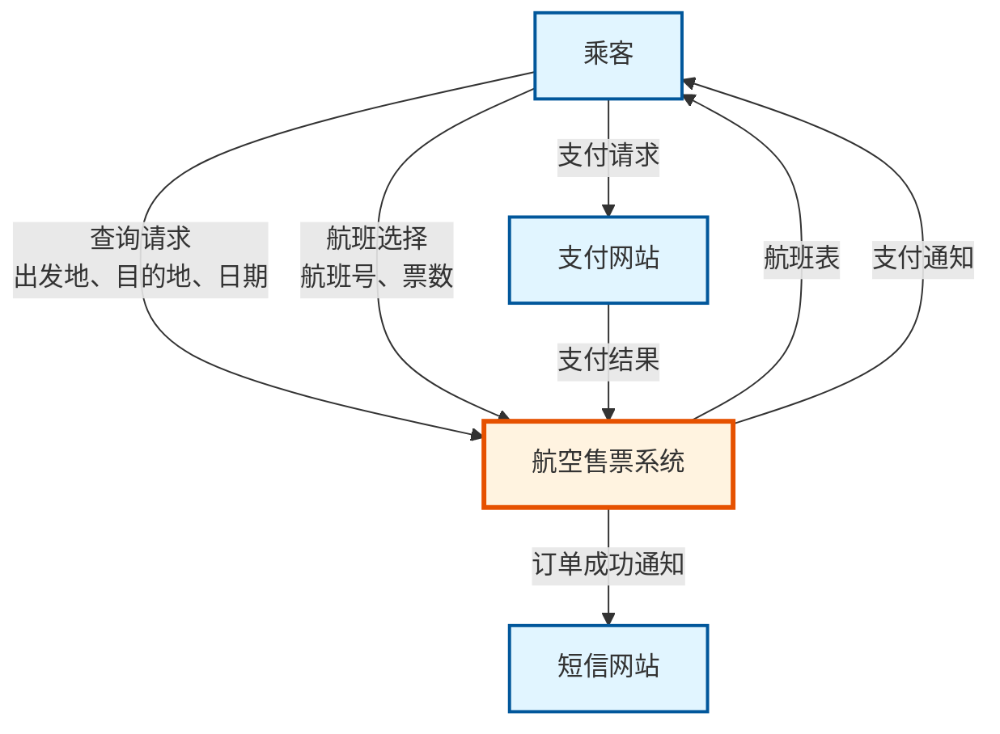
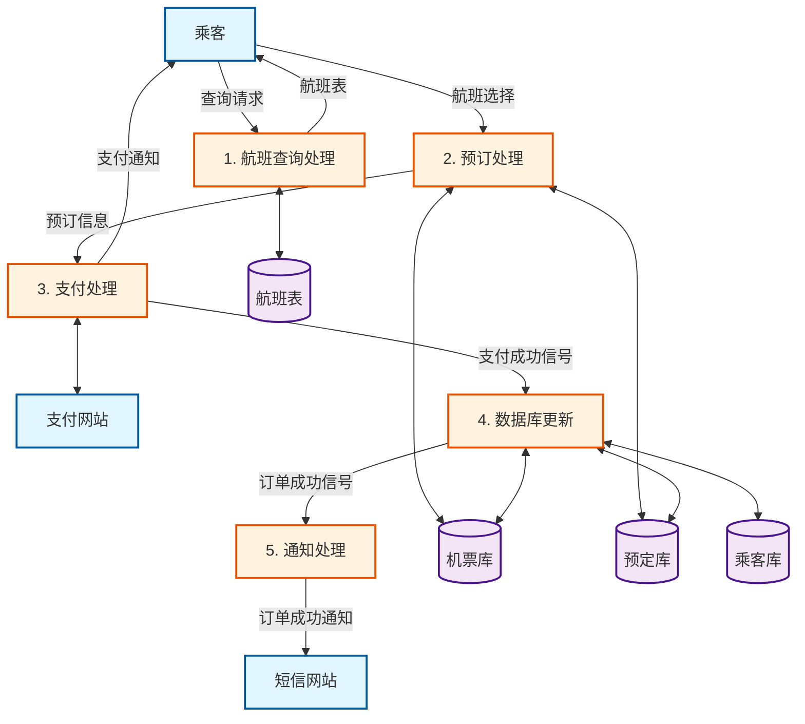
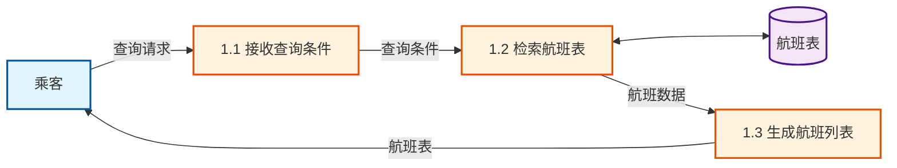
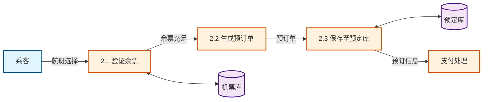
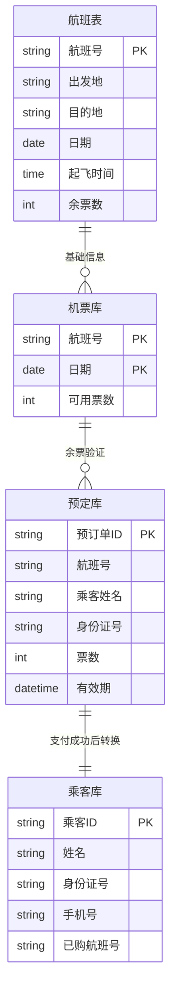
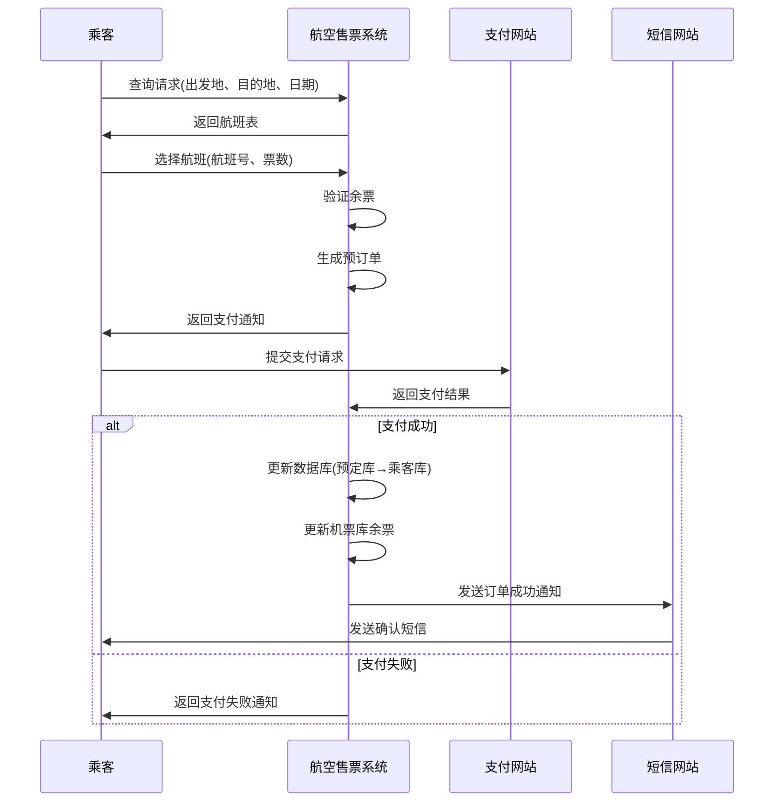

# 航空售票系统结构化分析实验报告

## 一、实验目的与要求
1. 掌握结构化建模（SA）方法和技术  
2. 熟悉数据流图DFD和数据字典DD的作用和画法  
3. 熟练运用数据流图和数据字典对需求分析建模  

## 二、实验类型
设计性实验  

## 三、实验原理及说明
系统需求建模是软件开发的基本任务，通过需求分析可明确系统必须提供的服务与功能。结构化分析（SA）采用自顶向下、逐步求精的方法，通过数据流图（DFD）描述数据从输入到输出的变换过程，直观展示系统逻辑功能。数据流图是结构化功能需求分析的有效工具，数据字典则对DFD中的元素进行详细定义，二者共同构成完整的结构化建模体系。

## 四、实验仪器
安装Microsoft Visio、Word软件的计算机若干台  

## 五、实验内容

### （一）航空售票系统DFD数据流图分析

#### 1. 顶层DFD图（0层图）

**外部实体**：  
- 乘客：系统的主要用户，提供查询条件、选择航班、提交身份信息  
- 支付网站：处理支付请求，返回支付结果  
- 短信网站：接收订单成功通知，发送短信  

**核心处理**：  
`航空售票系统`（作为单一处理过程）

**数据流**：  
- 乘客 → 系统：`查询请求（出发地、目的地、日期）`  
- 系统 → 乘客：`航班表`  
- 乘客 → 系统：`航班选择（航班号、票数）`  
- 系统 → 乘客：`支付通知`  
- 乘客 → 支付网站：`支付请求`  
- 支付网站 → 系统：`支付结果`  
- 系统 → 短信网站：`订单成功通知`

##### 顶层DFD图（0层图）可视化

#### 2. 一级分解DFD图（1层图）

将`航空售票系统`分解为5个子处理：  

1. **航班查询处理**  
   - 输入：`查询请求`（来自乘客）  
   - 输出：`航班表`（返回乘客）  
   - 数据存储：`航班表`（查询来源）  

2. **预订处理**  
   - 输入：`航班选择`（来自乘客）  
   - 输出：`预订信息`（传递至支付处理）  
   - 数据存储：`机票库`（查询余票）、`预定库`（保存预订）  

3. **支付处理**  
   - 输入：`预订信息`（来自预订处理）、`支付结果`（来自支付网站）  
   - 输出：`支付通知`（返回乘客）  
   - 外部交互：与`支付网站`双向通信  

4. **数据库更新**  
   - 输入：`支付成功信号`  
   - 动作：  
     - 将`预定库`中记录转入`乘客库`  
     - 更新`机票库`余票数量  

5. **通知处理**  
   - 输入：`订单成功信号`  
   - 输出：`订单成功通知`（发送至短信网站）

##### 一级分解DFD图（1层图）可视化

#### 3. 二级分解DFD图（2层图）

- **航班查询处理**细化为：  
  - ① 接收查询条件 → ② 检索航班表 → ③ 生成航班列表  

- **预订处理**细化为：  
  - ① 验证余票 → ② 生成预订单 → ③ 保存至预定库

##### 航班查询处理二级分解（2.1层图）

##### 预订处理二级分解（2.2层图）

#### 4. 信息连续性说明
- 0层图中`查询请求`在1层图分解为`出发地、目的地、日期`  
- 1层图中`航班表`在2层图对应`航班号、起飞时间、余票数`等数据项  
- 支付结果在1层图作为输入，在2层图中细化为`成功/失败状态码`

### （二）数据字典（DD）定义

#### 1. 关键数据流

| **数据流名**       | **组成**                                                                 |
|---------------------|--------------------------------------------------------------------------|
| 查询请求           | 出发地 + 目的地 + 日期                                                  |
| 航班表             | [航班号 + 起飞时间 + 到达时间 + 余票数]                                 |
| 支付请求           | 预订单ID + 乘客身份信息 + 金额                                          |
| 支付结果           | 支付状态（0=失败,1=成功） + 时间戳                                      |

#### 2. 数据存储

| **数据存储名**     | **组成**                                                                 | **说明**                     |
|---------------------|--------------------------------------------------------------------------|------------------------------|
| 航班表             | 航班号 + 出发地 + 目的地 + 日期 + 起飞时间 + 余票数                     | 基础航班信息                 |
| 机票库             | 航班号 + 日期 + 可用票数                                                 | 动态更新余票                 |
| 预定库             | 预订单ID + 航班号 + 乘客姓名 + 身份证号 + 票数 + 有效期                 | 未支付订单临时存储           |
| 乘客库             | 乘客ID + 姓名 + 身份证号 + 手机号 + 已购航班号                           | 已支付订单用户信息           |

#### 3. 数据项

| **数据项**         | **类型** | **取值范围**               | **说明**                     |
|---------------------|----------|----------------------------|------------------------------|
| 余票数             | 整型     | ≥0                         | 负值表示超售                 |
| 支付有效期         | 时间     | 15分钟                     | 从生成预订单开始计时         |
| 身份证号           | 字符串   | 18位（含X）                | 验证乘客身份                 |

##### 数据字典关系图

### （三）实验报告总结

1. **DFD绘制要点**  
   - 严格区分外部实体与处理过程（如支付网站是外部实体，支付处理是系统内部过程）  
   - 数据存储需与处理过程双向连接（如`机票库`既被查询也被更新）  
   - 避免"黑洞"（只有输入无输出）和"奇迹"（无输入却有输出）  

2. **数据字典作用**  
   - 明确定义`预定库`与`乘客库`的转换逻辑：仅当支付成功时，数据从预定库迁移到乘客库  
   - 规范数据格式（如身份证号长度验证），避免后续开发歧义  

3. **问题与改进**  
   - 0层图中未体现"无票重选"分支，需在1层图通过`余票验证`处理明确反馈路径  
   - 建议在数据字典中补充`支付失败`的处理规则（如3次失败后释放预占票源）

### （四）实验心得

通过本次航空售票系统的结构化分析实验，我深刻体会到了系统化建模在软件开发前期的重要作用。

**理论到实践的转化**：课堂上学习的DFD理论在本次实验中得到了充分应用。从最初的顶层抽象到逐层细化，我真切感受到了"自顶向下、逐步求精"的建模思想。特别是在绘制0层图时，如何准确识别外部实体与系统边界，这需要对业务需求有深入理解。我在最初绘制时曾将"支付处理"错误地标记为外部实体，后来才意识到应该区分"支付网站"（外部）和"支付处理"（内部业务逻辑）。

**层次分解的逻辑性**：在一级和二级分解过程中，我学会了如何保持信息的连续性和一致性。每个子处理的输入输出必须与上层图完全对应，这种严谨性让我意识到结构化分析不仅是画图，更是一种系统化的思维训练。例如，1层图中的"预订信息"在2层图需要分解为具体的数据项（航班号、乘客信息、票数等），这种细化过程帮助我更清晰地理解数据在系统中的流转。

**数据字典的价值**：起初我认为数据字典只是简单的数据定义，但在实际编写过程中发现，它是消除歧义、规范开发的关键工具。比如定义"余票数≥0"、"支付有效期15分钟"等约束条件，这些看似简单的规则在实际系统中却至关重要。如果没有明确定义，开发人员可能对"预定库"数据何时转移到"乘客库"产生不同理解。

**问题发现与思考**：实验过程中也暴露了一些容易忽视的设计细节。例如，当余票不足时的反馈机制、支付失败后的订单处理、超时预订的自动释放等异常流程，这些在初版DFD中并未充分体现。这提醒我在需求分析阶段必须充分考虑异常场景和边界条件，而不仅仅关注正常业务流程。

**工具使用感悟**：使用Visio和Mermaid绘制DFD图时，我体会到可视化工具在需求沟通中的重要性。一张清晰的数据流图能够让开发团队、产品经理甚至客户快速理解系统架构，这比冗长的文字描述更直观有效。同时，图表的规范性（如统一符号、清晰标注）也直接影响沟通效率。

**未来改进方向**：本次实验让我认识到，结构化分析虽然逻辑清晰，但在处理复杂交互和并发场景时存在局限性。未来学习面向对象分析（UML）和敏捷建模方法后，可以与SA方法互补使用，针对不同项目特点选择合适的建模工具。

总的来说，本次实验不仅巩固了理论知识，更培养了我系统化思考问题的能力。结构化分析强调的规范性、完整性和一致性，对今后从事软件开发工作具有重要的指导意义。

## 六、注意事项

1. **数据源点/终点识别**：乘客、支付网站、短信网站属于外部实体，不可分解为系统内部处理  
2. **数据流方向性**：所有数据流需标注箭头方向（如`支付结果`必须从支付网站流向系统）  
3. **层次一致性**：  
   - 0层图的`查询请求`必须与1层图中`出发地、目的地、日期`完全对应  
   - 2层图的`余票验证`处理需包含对`机票库`的读写操作  
4. **数据存储设计**：`预定库`需设置有效期字段，确保系统能自动清理过期预订

---

## 附：系统流程图总览

### 完整业务流程时序图

---

**附：Visio绘制建议**  
1. 使用标准DFD符号：  
   - 外部实体：矩形（如`乘客`）  
   - 处理：圆角矩形（如`航班查询处理`）  
   - 数据存储：开口矩形（如`机票库`）  
2. 分层绘制时，为每层图添加编号（0层、1层、2层）  
3. 用不同颜色区分数据流类型（如蓝色=查询，红色=支付）  

> 本报告基于2025年11月9日实验要求完成，所有数据流和存储设计均符合航空售票系统需求描述，满足结构化分析的规范性与完整性要求。

